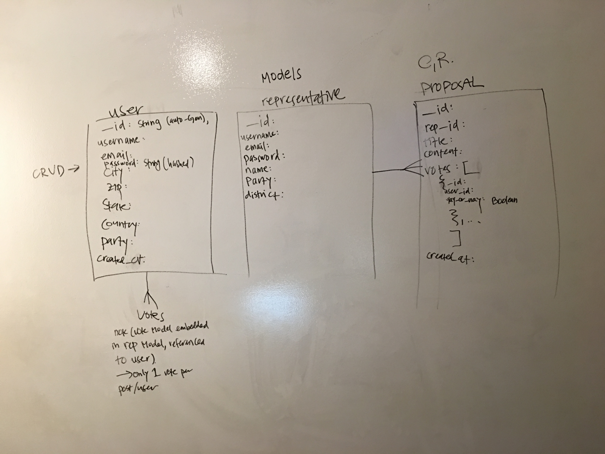
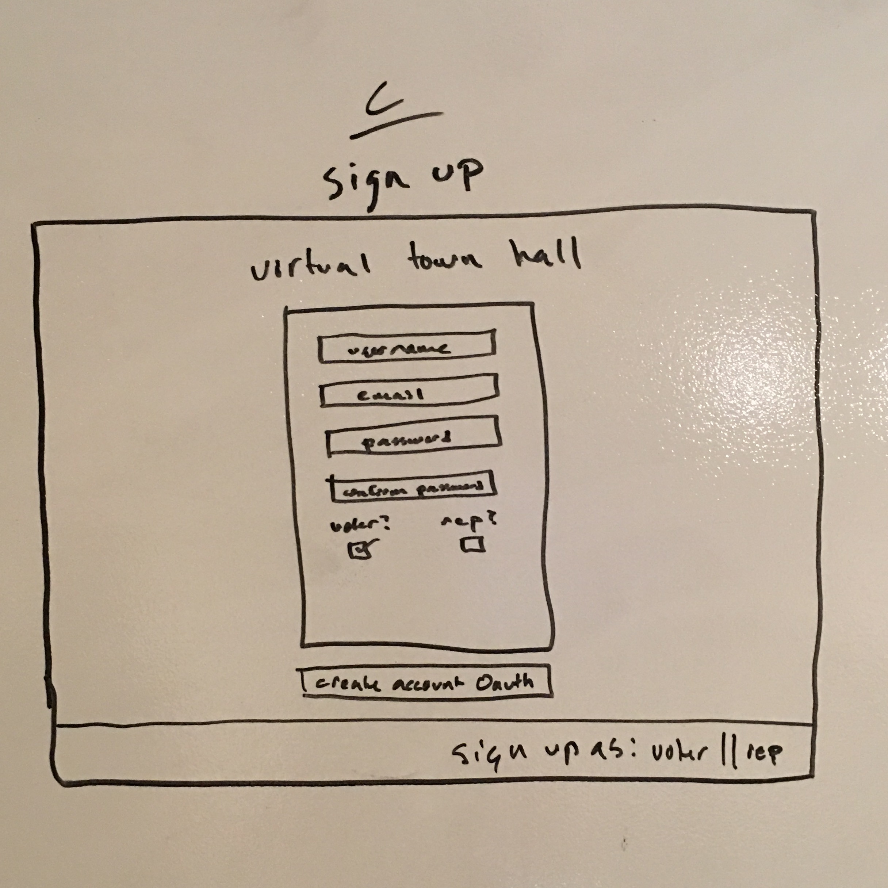
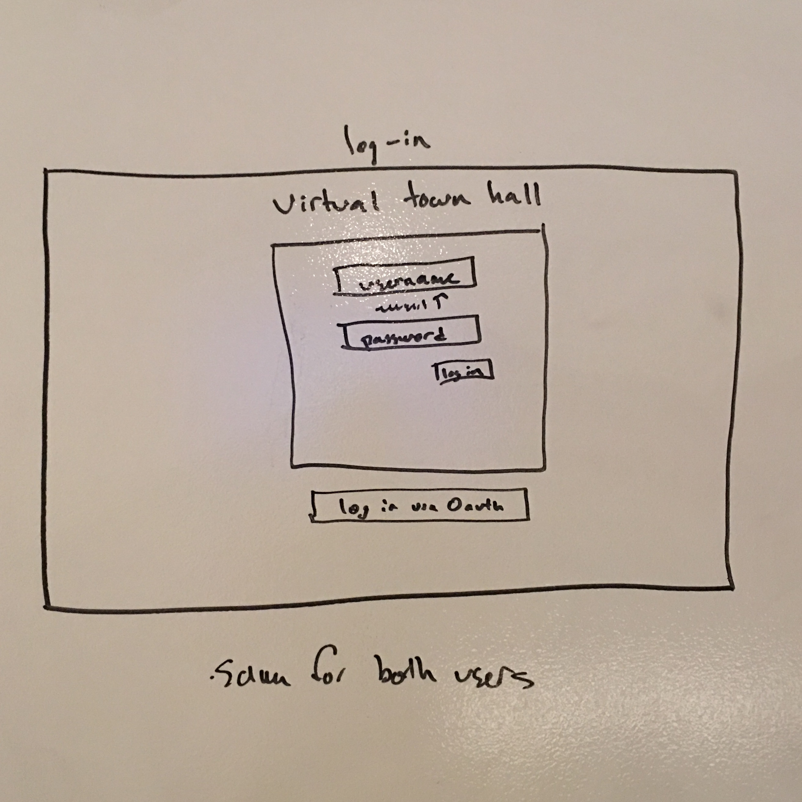
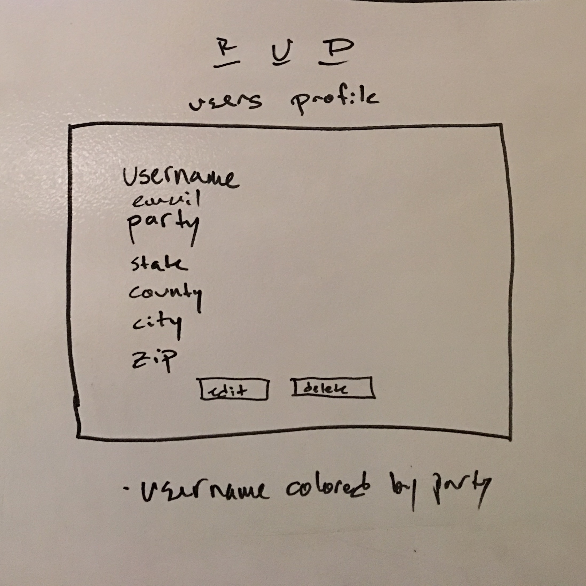
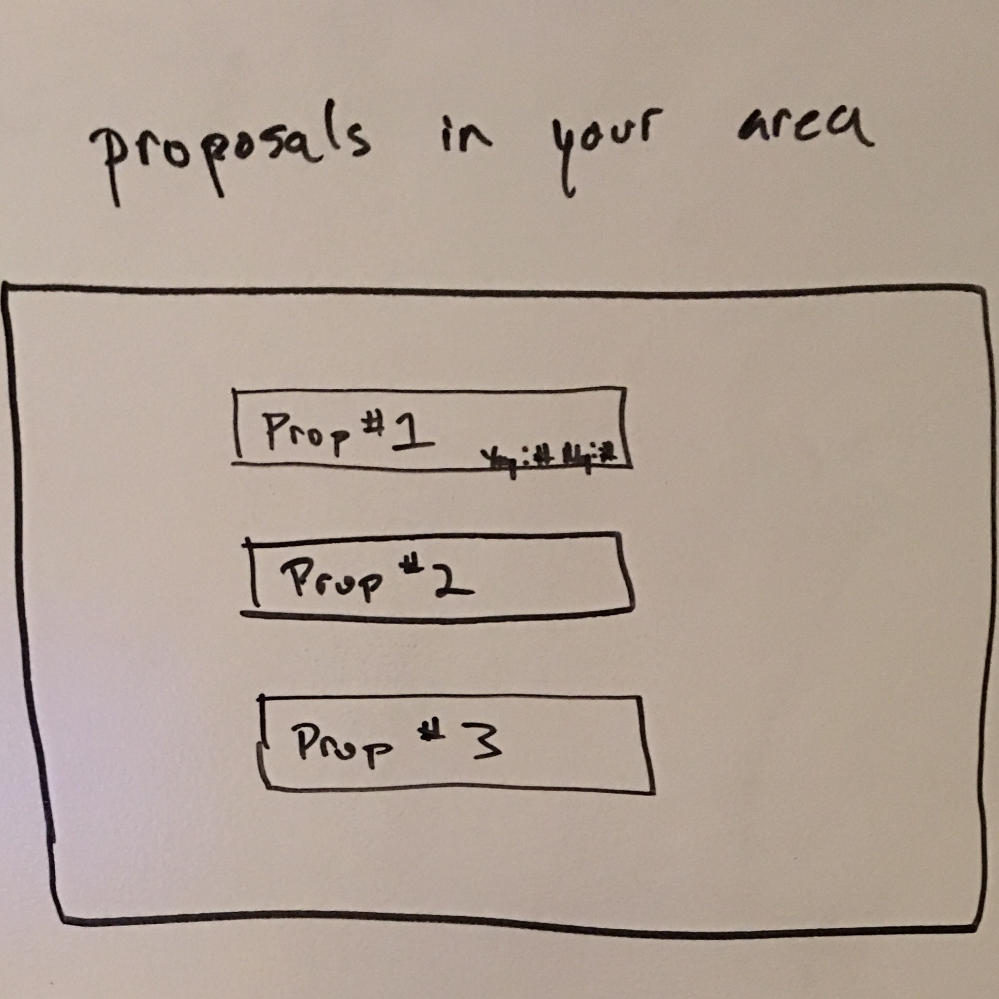
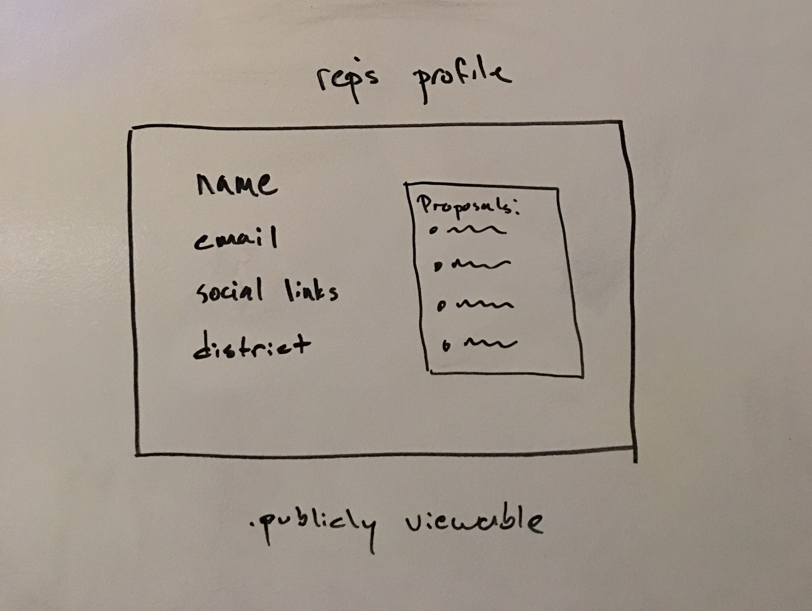
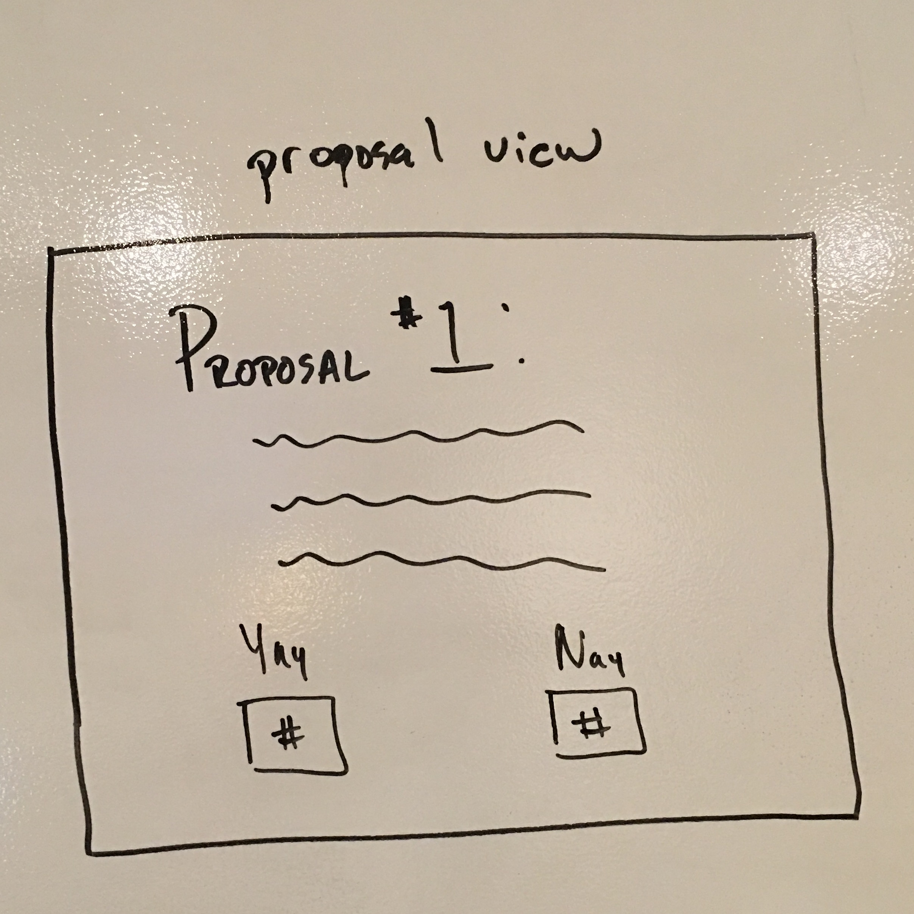
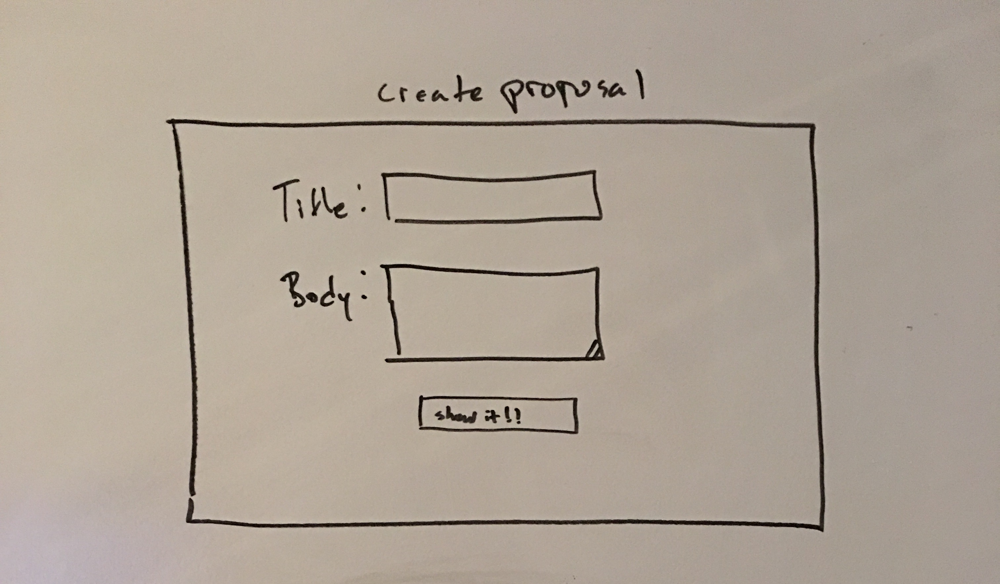

# Project 3 - TEST

**WDI-SM-43 Project 3 : Virtual Town Hall**

Team Branch Squad: John Lee, Betsy Donohue, Boone Reynolds, Steven Peltzer

**Presentation Deck:** https://docs.google.com/presentation/d/1V1WqcjMs_c-E9zHjgz9ZkVPYlm3Dg9Ska2o1C-YoEgA/edit?usp=sharing

**Technologies Used:**

- HTML / CSS / Javascript / EJS
- 'MEN' Stack: Mongo.db, Express, Node.Js
- Socket.io (Real-time Chat System)
- Facebook O Authentication
- APIs used: (TBD)

**General Approach:**

- Started off brainstorming
- All liked the idea of a Virtual Town Hall
  - Got the idea from Reps canceling their town hall meetings due to backlash
  - We believe reps are civil servants and need to vote based on the views of their constituents.  VTH gives them hard data and no choice but to listen to those voices, however small
- Divided up rolls based on interest
- Created ERD
- Developed wireframes/user experience

-Split into groups of 2 to CRUD the models as we all would like to be involved in the backend


**Installation Instructions:**

1.   Clone the Repository into your workspace.

     ```	$ git clone https://github.com/branchsquad/Project3```

     Then move into the new directory/folder.

     ```$ cd Project3```

2.   In your terminal run npm install to install all necessary dependency modules and packages

     ```$ npm install```  

3.   Host the server locally by running in the command line:

     ```$ node server.js```

     Or run nodemon if you have the package installed in your Node version.

     ```$ nodemon```

4.   To run the app locally, go to your browser of choice and port to http://localhost:3000

     For example: ```$ google-chrome http://localhost:3000```


**Link to Trello:**  https://trello.com/b/Qf7Y1PUR/project-3-virtual-town-hall


**Data Models:**



**Wireframes:**




















**Unsolved Problems / Major Problems:** (TBD)

​
